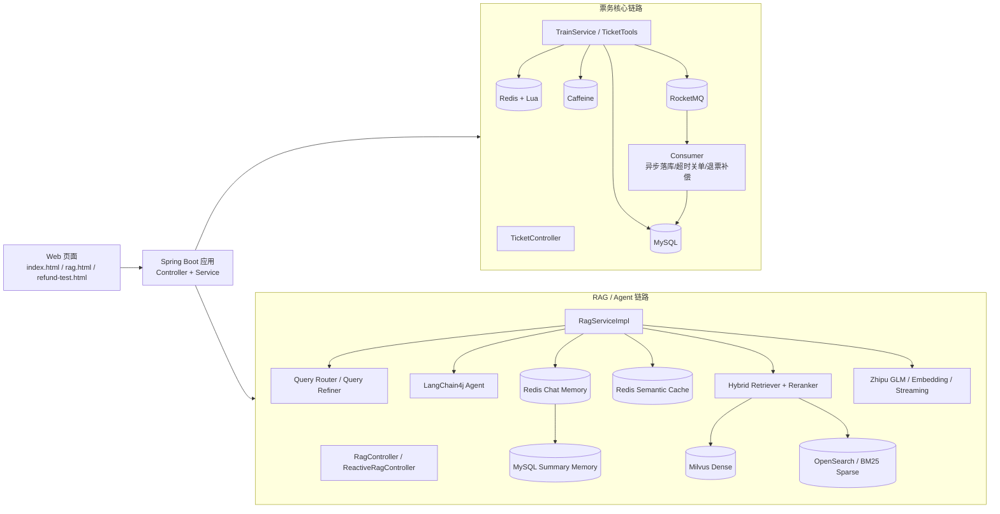

# 12306 Ticket Service & AI Assistant 🚅

这是一个基于 Spring Boot 3.x 构建的仿 12306 票务系统，集成了**高并发秒杀架构**与**基于 RAG 的 AI 智能助理**。

## 🌟 项目亮点

- **高并发票务引擎**：采用 Redis + Caffeine 两级缓存架构，结合 Redisson 分布式锁与 Lua 脚本实现高性能库存扣减。
- **智能化 RAG 助理**：基于 LangChain4j 与智谱 AI (GLM-4.7) 打造，支持向量检索（Milvus）与 PDF 知识库，能够精准回答票务规则与购票建议。
- **Agent 智能工具箱**：AI 助理集成内置工具（Function Calling），可直接调用 Java 后端接口执行查库、订票与退票操作。
- **响应式流式输出**：通过 Spring WebFlux 实现 SSE (Server-Sent Events)，提供像 ChatGPT 一样的打字机式交互体验。
- **自动化质量评估**：独立 Python 模块（Ragas Eval），量化评估 RAG 系统在忠实度与相关性上的表现。

## 🛠️ 技术栈

- **后端**: Spring Boot 3.0.2, Spring WebFlux, MyBatis Plus
- **AI 框架**: LangChain4j 0.36.0
- **中间件**: MySQL, Redis (Redisson), RocketMQ, Milvus (向量库), Sentinel (限流)
- **本地缓存**: Caffeine
- **自动化测试**: JMeter 5.x, Ragas (Evaluation)
- **配置与部署**: Docker Compose

## 🏗️ 项目架构

### 1. 总体架构



### 2. 票务链路

- 页面通过 `index.html` 调用 `/train/all`、`/train/book/lua`、`/user/orders`、`/user/pay`、`/user/refund`。
- 查询车次时优先走 `Caffeine + Redis`，降低数据库压力。
- 购票时核心扣减在 `Redis + Lua` 完成，保证高并发下库存扣减的原子性。
- 下单成功后通过 `RocketMQ` 异步解耦落库、超时关单、退票补偿，避免请求线程阻塞。
- 最终订单、车次、库存事实状态以 `MySQL` 为准。

### 3. RAG / Agent 链路

- 页面通过 `rag.html` 调用 `/rag/ask` 或 `/rag/ask/stream`，SSE 负责打字机输出。
- `RagServiceImpl` 内部会先经过 `Guardrails`、本地快路径、意图路由、问题重写，再决定走工具执行还是知识库检索。
- 如果是购票、退票、查订单这类动作型请求，优先走 `Agent + Tools`，直接调用本地 Java 工具。
- 如果是政策类问题，优先走 `Hybrid Retriever`：
  - Dense 通道：`Milvus` 做向量召回
  - Sparse 通道：`OpenSearch/BM25` 做关键词召回
  - 融合后再经过 `Reranker` 精排
- 最终由 `GLM` 生成答案，流式场景通过 `StreamingChatLanguageModel + SSE` 推给前端。

### 4. 上下文记忆与缓存

- 会话维度通过 `username::sessionId` 绑定，保证同一用户同一会话下的上下文连续。
- 短期记忆存放在 `Redis Chat Memory`，保留最近若干轮精确消息。
- 长期记忆在窗口淘汰时自动压缩为摘要，落到 `MySQL`，避免长对话上下文无限膨胀。
- 对“讲得更具体一点”“继续”这类追问，服务端会额外做一层 `上下文桥接`，把上一轮问题和回答补进当前请求，避免被误判成闲聊。
- 语义层面还有一层 `Redis Semantic Cache`，相似问题可直接命中缓存，减少重复的 embedding、检索和生成成本。

### 5. 可观测性与限流

- `Sentinel` 负责接口级和热点车次级限流，防止查询和下单接口被突发流量打穿。
- `rag.html` 当前已支持展示 RAG 链路阶段耗时，例如：
  - `guardrails`
  - `intent_route`
  - `query_refine`
  - `embedding`
  - `semantic_cache_lookup`
  - `llm_first_token`
- 压测使用 `JMeter`，评估使用 `Ragas`，分别覆盖高并发票务链路与 RAG 质量链路。

## 🚀 快速开始

### 1. 克隆与环境准备
确保您已安装：
- Java 17+
- Maven 3.8+
- Docker & Docker Compose
- Python 3.9+ (用于 RAG 评估)

### 2. 启动项目
推荐只使用这一套命令：
```bash
./dev-start.sh
```

它会自动：
- 识别当前 Docker 后端模式
- 启动 Docker 中间件
- 等待 MySQL、Redis、OpenSearch、Milvus、RocketMQ 就绪
- 在当前终端启动 Spring Boot

查看当前 Docker 后端模式：
```bash
./dev-mode.sh
```

- `desktop`：当前使用 Docker Desktop，脚本会自动走 Windows 主机 IP
- `native`：当前使用 WSL2 原生 Docker Engine，脚本会自动走 Linux 本地 `127.0.0.1`

如果您准备把中间件彻底迁到 WSL2 原生 Docker，请看：
- [WSL2_NATIVE_DOCKER.md](/root/projects/12306-ticket-service/WSL2_NATIVE_DOCKER.md)

容器默认暴露以下端口，WSL 内运行的 Spring Boot 可直接通过 `127.0.0.1` 访问：

- MySQL: `${MYSQL_PUBLISHED_PORT:-23306}`（容器内固定 `3306`，默认避开 Windows 常见冲突端口）
- Redis: `127.0.0.1:${REDIS_PUBLISHED_PORT:-26379}`（容器内固定 `6379`，默认避开宿主机常见冲突端口）
- RocketMQ NameServer: `9876`
- Milvus gRPC: `${MILVUS_GRPC_PUBLISHED_PORT:-19530}`
- Milvus HTTP: `${MILVUS_HTTP_PUBLISHED_PORT:-19091}`
- MinIO API: `${MINIO_API_PUBLISHED_PORT:-19000}`
- MinIO Console: `${MINIO_CONSOLE_PUBLISHED_PORT:-19001}`
- Sentinel Dashboard: `${SENTINEL_PUBLISHED_PORT:-18858}`（容器内固定 `8858`）

如果 Windows/虚拟机环境报错 `bind ... 0.0.0.0:3306`（端口占用或被系统策略保留），
请改用其他宿主机端口，例如 `23306`：

```bash
# Bash/WSL（默认已是 23306，如需改端口再设置）
export MYSQL_PUBLISHED_PORT=23306
export DB_PORT=23306
docker compose -f docker-compose.dev.yml up -d mysql
```

```powershell
# PowerShell（默认已是 23306，如需改端口再设置）
$env:MYSQL_PUBLISHED_PORT="23306"
$env:DB_PORT="23306"
docker compose -f docker-compose.dev.yml up -d mysql
```

### 3. 配置应用
1. 复制配置模板：
   ```bash
   cp src/main/resources/application.yml.template src/main/resources/application.yml
   ```
2. 编辑 `src/main/resources/application.yml`，填入您的：
   - 数据库连接信息（如果使用默认 `docker-compose.dev.yml`，MySQL/Redis/RocketMQ/Milvus 都可直接保持默认值）
3. 导出智谱 API Key：
   ```bash
   export ZHIPU_API_KEY='your-real-key'
   ```
4. 如需覆盖 embedding 模型，可显式指定：
   ```bash
   export ZHIPU_EMBEDDING_MODEL=embedding-2
   ```

说明：
- 默认 embedding 模型已对齐智谱官方命名，使用 `embedding-2`
- 如果你使用 `embedding-3`，需要确认向量库维度和历史索引是否需要重建

### 4. 访问后端
一键脚本启动成功后，直接在 Windows 浏览器访问：
```text
http://localhost:8899/
```

说明：
- `./dev-start.sh` 默认以前台模式运行，终端需要保持打开。
- 如需手动停止，前台模式直接按 `Ctrl+C`。
- 如需分离到后台 `tmux` 会话，可显式执行 `./dev-start.sh --tmux`。
- 如果 Windows 的 `http://localhost:8899/` 转发失效，可在管理员 PowerShell 执行 `powershell -ExecutionPolicy Bypass -File .\tools\fix-wsl-localhost-8899.ps1` 修复到当前 WSL IP。

如果需要查看日志：
```bash
tail -f .run/spring-boot.log
```

### 5. 停止与清理
```bash
./dev-stop.sh
```

如果要连同 Docker 中间件一起停掉：
```bash
./dev-stop.sh --with-middleware
```

如果要连同 MySQL/Redis/RocketMQ 的持久化数据一起清掉：
```bash
docker compose -f docker-compose.dev.yml down -v
```

## 📊 性能与评估

### RAG 系统评估
进入 `ragas_eval` 目录运行评估脚本：
```bash
cd ragas_eval
pip install -r requirements.txt
# 设置环境变量 ZHIPU_API_KEY
python evaluate.py
```

可切换评测目标：

```bash
# 评 Java RAG
RAG_TARGET=java_rag python evaluate.py

# 评 Python Agent
RAG_TARGET=python_agent python evaluate.py
```

### 压测报告
项目包含以下 JMeter 压测脚本：

- `ticket-query-load-test.jmx`：查票基线压测
- `ticket-book-load-test.jmx`：购票主链路前门压测
- `ticket-mixed-load-test.jmx`：查票 + 购票混合流量压测

完整压测方案见 `docs/load-test-plan.md`。

示例：

```bash
jmeter -n -t ticket-book-load-test.jmx \
  -Jhost=127.0.0.1 -Jport=8899 -JtrainNumber=G1 \
  -Jusers=200 -Jramp=60 -Jduration=600 \
  -JusernamePrefix=load_user \
  -l result-book.jtl -e -o html-report-book
```

```bash
jmeter -n -t ticket-mixed-load-test.jmx \
  -Jhost=127.0.0.1 -Jport=8899 -JtrainNumber=G1 \
  -JqueryUsers=1000 -JbookUsers=50 -Jramp=120 -Jduration=900 \
  -JusernamePrefix=load_user \
  -l result-mixed.jtl -e -o html-report-mixed
```

压测前建议先执行：

```bash
curl "http://127.0.0.1:8899/train/init?trainNumber=G1"
```

压测后建议立刻执行库存对账：

```bash
curl "http://127.0.0.1:8899/audit/reconcile/stock/G1"
```

## 📁 目录结构

- `src/main/java/com/ahu/ticket/rag`: RAG 核心逻辑与 Agent 工具。
- `src/main/java/com/ahu/ticket/service`: 业务服务层（高并发订票逻辑）。
- `ragas_eval`: 基于 Python 的 RAG 评估模块。
- `volumes`: 容器持久化数据。

## 📜 许可证

本项目仅用于学习与研究。
